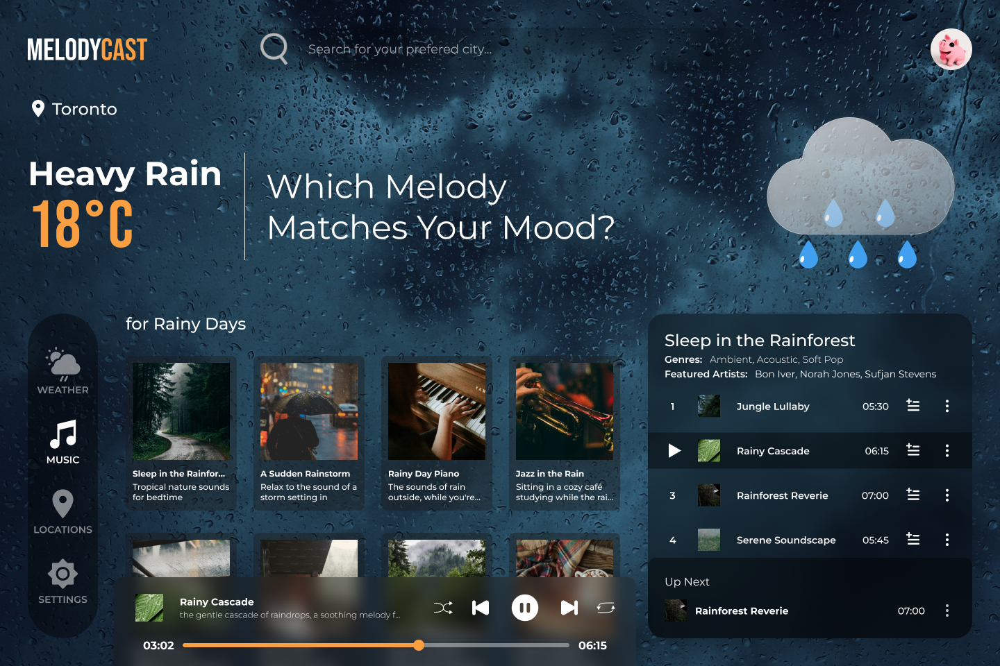

# **WDDM121- An API Project**

<h1 align="center"></h1>

By

<h2 align="center">Group 10</h2>

## Authors

- AISHA ABUBAKAR LADAN   

- EMMANUEL DIOGU   

- DINH VINH PHUOC VAN   

<h3 align="center">May 2024</h3>

## **INTRODUCTION**

In this research paper, we shall examine the APIs used in this project, explore their integration procedures, and elucidate the specific functionalities they offer. Additionally, we will provide insights into how React will be utilized to construct a dynamic and responsive website.

## **ABOUT MELODYCAST**

MelodyCast is a music app that selects songs inspired by the weather of the user's location. How the app works; When a user enters a city name in the search box, our app will fetch the weather data for that city. Based on the weather report, it will suggest music that matches the mood and dynamically adjusts the app’s background to reflect the current weather conditions.

## **ABOUT APIs USED**

### **Weather API (**[**OpenWeatherMap**](https://openweathermap.org/api)**):**

OpenWeatherMap is a commercial service that provides historical, current, and forecasted weather data via light-speed APIs (OpenWeather, 2014). It was founded by **Andre Kiselev** and launched in **April 2014** through OpenWeather Ltd; the official website is **_openweathermap.org._**

### **Image API (**[**Pexels API**](https://www.pexels.com/api/)**):**

The Pexels API provides developers with a rich media collection for their applications or websites. The Pexels API is hosted on the [**Pexels API website**](https://www.pexels.com/api/) and was founded in **2014** by twin brothers **Bruno and Ingo Joseph** and **Daniel Frese** who joined in 2015 (Pexels, 2023). The entire Pexels platform is a collaborative effort by photographers, curators, and developers.

### **iTunes Search API (**[**iTunes API**](https://performance-partners.apple.com/search-api)**):**

The Search API allows you to place search fields on your website to search for content within the iTunes Store and Apple Books Store. You can search for content, including books, movies, podcasts, music, music videos, audio-books, and TV shows (Apple, 2024). Apple developed iTunes Search API with no publicly documented date of its founding.

## **DOCUMENTS AND LINKS**

- [Research Paper](./API%20Research%20Paper.pdf)
- [Figma Design](https://www.figma.com/design/13ly9mi751NQF0CByYH5GT/Weather-Website?node-id=19-4333&t=gOCuqdf6qTIFvVZd-0)
- [Webpage]()